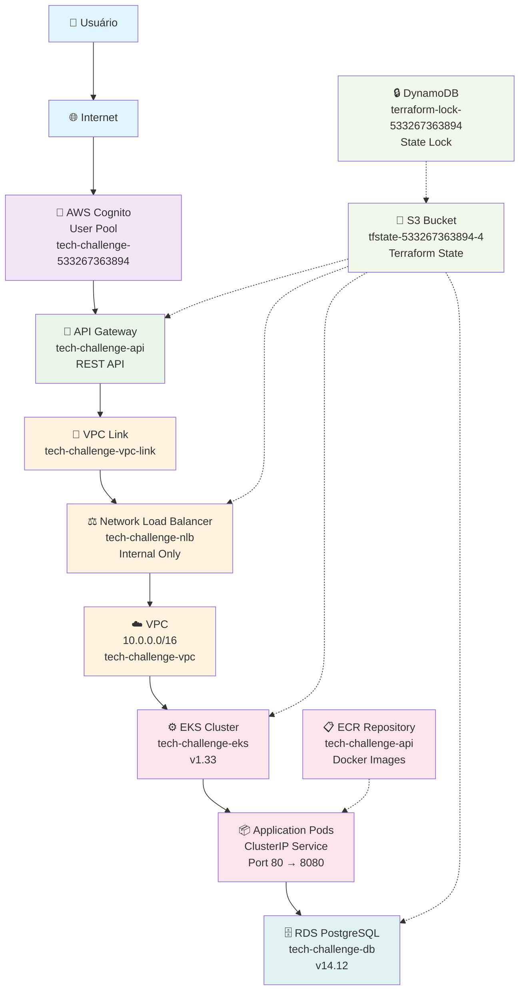
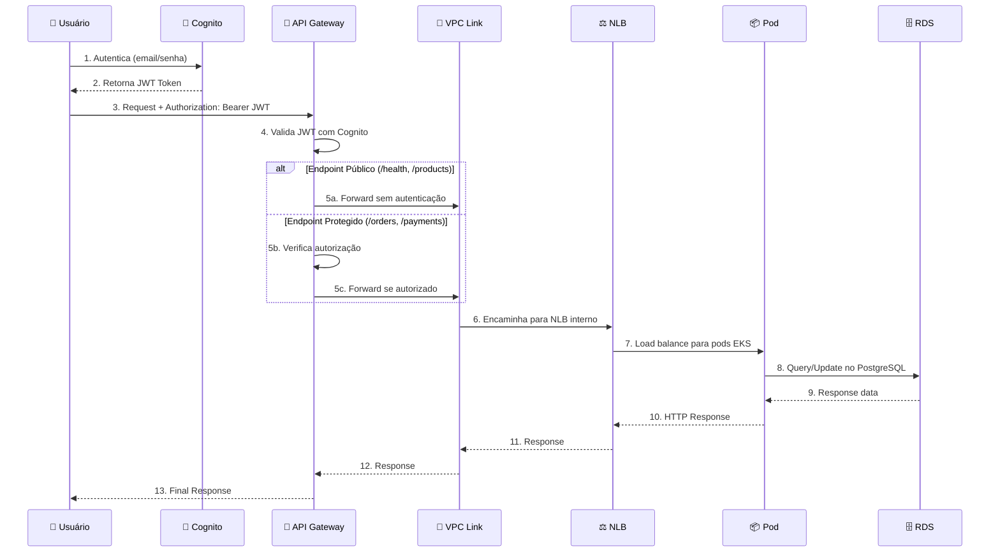
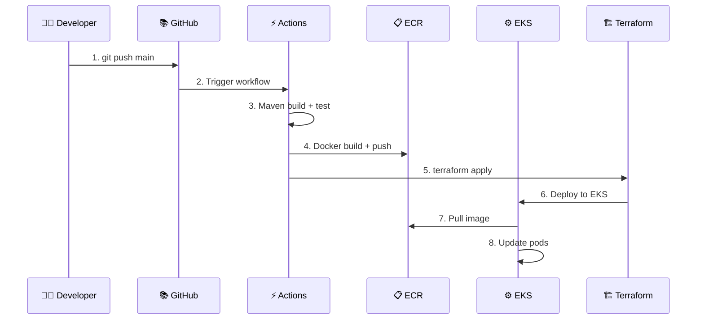
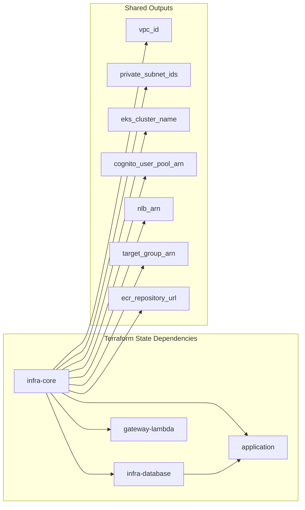

# Arquitetura Tech Challenge - Documentação Completa

## 🏗️ Diagrama de Arquitetura



## 🔄 Fluxo de Dados Detalhado

### 📱 Fluxo do Usuário (Request)



### 🚀 Fluxo de Deploy (CI/CD)



---

## 📊 Detalhamento dos Componentes

### 🏗️ **1. Infraestrutura Core (infra-core)**

| Componente | Configuração | Finalidade |
|------------|-------------|-----------|
| **VPC** | `10.0.0.0/16` | Rede privada isolada |
| **Subnets Privadas** | `10.0.1.0/24`, `10.0.2.0/24` | EKS nodes em 2 AZs |
| **Subnet Pública** | `10.0.0.0/24` | NAT Gateway |
| **EKS Cluster** | v1.33, 1 node SPOT | Kubernetes cluster |
| **Cognito User Pool** | `tech-challenge-533267363894` | Autenticação JWT |
| **ECR Repository** | `tech-challenge-api` | Imagens Docker |
| **Network Load Balancer** | Interno, TCP 80 | Load balancing |

### 🗄️ **2. Banco de Dados (infra-database)**

| Componente | Configuração | Finalidade |
|------------|-------------|-----------|
| **RDS PostgreSQL** | v14.12, db.t3.micro | Dados da aplicação |
| **Subnet Group** | Spans 2 AZs privadas | Alta disponibilidade |
| **Security Group** | Porta 5432 do EKS | Acesso controlado |

### 🐳 **3. Aplicação (application)**

| Componente | Configuração | Finalidade |
|------------|-------------|-----------|
| **Docker Image** | Java 17 Spring Boot | API REST |
| **Kubernetes Service** | ClusterIP, porta 80 | Serviço interno |
| **TargetGroupBinding** | Conecta pods ao NLB | Integração AWS/K8s |
| **Deployment** | 1 replica, health checks | Aplicação rodando |

### 🌐 **4. API Gateway (infra-gateway-lambda)**

| Componente | Configuração | Finalidade |
|------------|-------------|-----------|
| **REST API** | `tech-challenge-api` | Entrada pública |
| **VPC Link** | Conecta ao NLB | Bridge público/privado |
| **Cognito Authorizer** | Valida JWT tokens | Autenticação |
| **Métodos** | 7 endpoints | Operações CRUD |

---

## 🔗 Mapeamento de Integrações

### 🎯 **Remote State Dependencies**



### 📡 **Integração entre Componentes**

| Origem | Destino | Tipo de Integração | Configuração |
|--------|---------|-------------------|--------------|
| **API Gateway** → **NLB** | VPC Link | `aws_api_gateway_vpc_link` | `target_arns = [nlb_arn]` |
| **NLB** → **EKS Pods** | TargetGroupBinding | `kubernetes_manifest` | `targetGroupARN` + `serviceRef` |
| **Cognito** → **API Gateway** | Authorizer | `aws_api_gateway_authorizer` | `provider_arns = [cognito_arn]` |
| **EKS** → **RDS** | Security Group | `aws_security_group_rule` | `source_security_group_id` |
| **GitHub Actions** → **ECR** | Docker Push | AWS CLI | `docker push $ECR_REGISTRY/$ECR_REPOSITORY` |
| **EKS** → **ECR** | Image Pull | Kubernetes | `image: ecr_repository_url:tag` |

---

## ⚙️ Configurações Compartilhadas entre Repositórios

### 🔄 **Configurações que Devem Ser Sincronizadas**

#### 🏷️ **1. Naming Conventions**

| Variável | Valor Atual | Usado em | Impacto se Mudar |
|----------|-------------|----------|------------------|
| `project_name` | `"tech-challenge"` | **Todos** | 🔴 **CRÍTICO** - Quebra todas as referências |
| `aws_region` | `"us-east-1"` | **Todos** | 🔴 **CRÍTICO** - Resources em região errada |
| `account_id` | `"533267363894"` | **Todos** | 🔴 **CRÍTICO** - Bucket S3 e recursos incorretos |

#### 🗄️ **2. Database Configuration**

| Configuração | Valor | Repositórios | Sincronização Necessária |
|--------------|-------|--------------|------------------------|
| `db_instance_identifier` | `"tech-challenge-db"` | database, application | ✅ Deve ser idêntico |
| `db_name` | `"tech_challenge"` | database, application | ✅ Deve ser idêntico |
| `db_username` | `"postgres"` | database, application | ✅ Deve ser idêntico |
| `db_port` | `5432` | database, application | ✅ Deve ser idêntico |

#### 🔐 **3. Security & Authentication**

| Configuração | Valor | Repositórios | Observações |
|--------------|-------|--------------|-------------|
| `cognito_user_pool_name` | `"tech-challenge-user-pool"` | core, gateway | Nome deve ser único |
| `cognito_client_name` | `"tech-challenge-app-client"` | core, gateway | Cliente para app |
| `api_gateway_name` | `"tech-challenge-api"` | gateway | Nome da API |

#### 🌐 **4. Network Configuration**

| Configuração | Valor | Repositórios | Criticidade |
|--------------|-------|--------------|-------------|
| `vpc_cidr` | `"10.0.0.0/16"` | core, database, application | 🔴 **CRÍTICO** |
| `private_subnet_cidrs` | `["10.0.1.0/24", "10.0.2.0/24"]` | core, database | 🔴 **CRÍTICO** |
| `public_subnet_cidr` | `"10.0.0.0/24"` | core | 🟡 **MÉDIO** |

#### 🐳 **5. Container Configuration**

| Configuração | Valor | Repositórios | Impacto |
|--------------|-------|--------------|---------|
| `ecr_repository_name` | `"tech-challenge-api"` | core, application | 🔴 **CRÍTICO** |
| `eks_cluster_name` | `"tech-challenge-eks"` | core, application | 🔴 **CRÍTICO** |
| `kubernetes_namespace` | `"default"` | application | 🟡 **MÉDIO** |
| `service_port` | `80` | application, gateway | 🔴 **CRÍTICO** |
| `container_port` | `8080` | application | 🟡 **MÉDIO** |

#### 📦 **6. Terraform Backend**

| Configuração | Valor | Repositórios | Sincronização |
|--------------|-------|--------------|---------------|
| `s3_bucket` | `"tech-challenge-tfstate-533267363894-4"` | **Todos** | 🔴 **CRÍTICO** |
| `dynamodb_table` | `"tech-challenge-terraform-lock-533267363894"` | **Todos** | 🔴 **CRÍTICO** |
| `terraform_version` | `"1.5.0"` | **Todos** (workflows) | 🟡 **MÉDIO** |

---

## 📝 Procedimento para Mudanças de Configuração

### 🚨 **Configurações Críticas (Requer Mudança em Todos)**

1. **project_name**: 
   ```bash
   Arquivos: variables.tf (todos os repos)
   Impacto: Todos os recursos serão recriados
   ```

2. **account_id**:
   ```bash
   Arquivos: bootstrap/main.tf, terraform backend configs
   Impacto: Novo bucket S3, migração de state necessária
   ```

3. **aws_region**:
   ```bash
   Arquivos: provider configs, workflows
   Impacto: Todos os recursos em nova região
   ```

### 🔄 **Ordem para Aplicar Mudanças Globais**

```bash
1. Atualizar variables.tf em todos os repositórios
2. Fazer commit sem push
3. Executar terraform plan em cada repositório para validar
4. Push em ordem:
   - infra-core (primeiro)
   - infra-database 
   - application
   - infra-gateway-lambda (último)
```

### 📋 **Checklist de Sincronização**

- [ ] `project_name` idêntico em todos os `variables.tf`
- [ ] `account_id` correto em bootstrap e backend configs
- [ ] Nomes de recursos seguem padrão `${var.project_name}-<component>`
- [ ] Versão do Terraform idêntica em todos os workflows
- [ ] Configurações de rede (CIDR, subnets) consistentes
- [ ] Nomes de ECR, EKS, RDS seguem convenção
- [ ] Secrets e variáveis de ambiente sincronizadas

---

## 🎯 Endpoints da API

### 🔓 **Endpoints Públicos (Sem Autenticação)**

| Endpoint | Método | Descrição | Uso |
|----------|--------|-----------|-----|
| `/actuator/health` | GET | Health check | Monitoramento |
| `/api/products` | GET | Lista produtos | Catálogo público |
| `/api/categories` | GET | Lista categorias | Navegação |
| `/api/webhooks` | POST | Webhooks externos | Integrações |

### 🔐 **Endpoints Protegidos (Cognito JWT)**

| Endpoint | Método | Descrição | Autorização |
|----------|--------|-----------|-------------|
| `/api/orders` | GET | Lista pedidos | Token válido |
| `/api/payments` | POST | Processar pagamento | Token válido |
| `/api/customers` | GET | Dados do cliente | Token válido |

---

## 🛡️ Segurança e Compliance

### 🔒 **Camadas de Segurança**

1. **Network Security**
   - VPC isolada com subnets privadas
   - NLB interno (não exposto à internet)
   - Security Groups restritivos

2. **Authentication & Authorization**
   - JWT tokens via Cognito
   - API Gateway authorizer
   - Endpoints públicos limitados

3. **Data Security**
   - RDS em subnet privada
   - Criptografia em trânsito (HTTPS/TLS)
   - Secrets hardcoded (apenas para DEV)

### 💰 **Otimizações de Custo**

- **EKS**: 1 node SPOT instance (70% economia)
- **RDS**: db.t3.micro (Free Tier elegível)
- **Logs**: Retenção 1-3 dias
- **ECR**: Lifecycle policy (máximo 10 imagens)
- **API Gateway**: Throttling 50 req/s

---

## 🚀 Deploy e Operação

### ⚡ **Comando de Deploy Completo**

```bash
# 1. Bootstrap (apenas primeira vez)
gh workflow run bootstrap.yml -R group-240/tech-challenge-infra-core

# 2. Deploy da infraestrutura (ordem obrigatória)
gh workflow run main.yml -R group-240/tech-challenge-infra-core
sleep 300  # Aguarda EKS cluster ficar pronto

gh workflow run main.yml -R group-240/tech-challenge-infra-database  
sleep 180  # Aguarda RDS ficar pronto

gh workflow run main.yml -R group-240/tech-challenge-application
sleep 240  # Aguarda deployment no EKS

gh workflow run deploy.yml -R group-240/tech-challenge-infra-gateway-lambda
```

### 🔍 **Verificação de Deploy**

```bash
# Verificar infraestrutura
aws eks describe-cluster --name tech-challenge-eks
aws rds describe-db-instances --db-instance-identifier tech-challenge-db
aws elbv2 describe-load-balancers --names tech-challenge-nlb

# Verificar aplicação
kubectl get pods -n default
kubectl get svc -n default
kubectl logs deployment/tech-challenge-app

# Testar API
curl https://<api-gateway-url>/api/health
```

---

## 📈 Monitoramento e Troubleshooting

### 📊 **Logs e Métricas**

| Componente | Logs | Métricas |
|------------|------|----------|
| **EKS** | CloudWatch Logs (3 dias) | Cluster metrics |
| **RDS** | CloudWatch Logs (1 dia) | Performance Insights |
| **API Gateway** | CloudWatch Logs | Request/Error rates |
| **NLB** | Flow Logs (desabilitado) | Connection metrics |

### 🔧 **Comandos de Troubleshooting**

```bash
# EKS
kubectl describe targetgroupbinding tech-challenge-tgb
kubectl logs -n kube-system deployment/aws-load-balancer-controller

# RDS
aws rds describe-db-instances --db-instance-identifier tech-challenge-db

# NLB
aws elbv2 describe-target-health --target-group-arn <target-group-arn>

# API Gateway
aws logs describe-log-groups --log-group-name-prefix /aws/apigateway/tech-challenge
```

**Esta documentação reflete o estado atual da arquitetura Tech Challenge com todas as integrações e dependências mapeadas.** 🚀