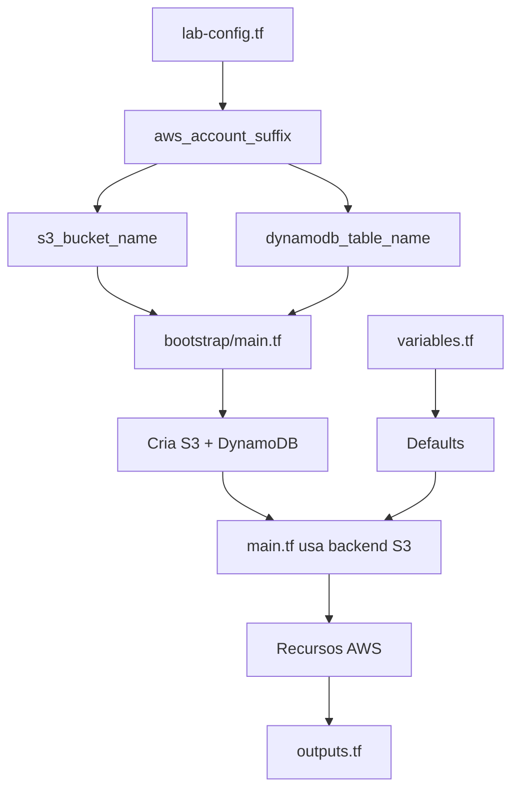

# 📋 Guia de Configuração Centralizada

## 🎯 Filosofia: Um Único Ponto de Mudança

Toda a configuração da infraestrutura é centralizada para facilitar a manutenção. Você altera **UM valor em UM arquivo** e ele se propaga automaticamente para todos os recursos.

---

## 📁 Estrutura de Arquivos

```
tech-challenge-infra-core/
├── lab-config.tf           # 🎯 CONFIGURAÇÃO CENTRAL (locals)
├── variables.tf            # 📝 Variáveis com defaults (sem .tfvars)
├── outputs.tf              # 📤 TODOS os outputs aqui
├── main.tf                 # 🏗️ Recursos principais
└── bootstrap/
    ├── main.tf             # 🚀 Criação do backend S3/DynamoDB
    ├── variables.tf        # 📝 Variáveis com defaults
    └── outputs.tf          # 📤 Outputs do bootstrap
```

---

## ⚙️ Arquivos e Suas Responsabilidades

### **1. `lab-config.tf` - Configuração Central** 🎯

**Propósito:** Local único para todas as configurações fixas da conta AWS.

**O que contém:**
- ✅ Account ID
- ✅ Account Suffix (⚠️ **PONTO ÚNICO DE MUDANÇA**)
- ✅ Região AWS
- ✅ Nomes dos recursos S3/DynamoDB (gerados automaticamente)
- ✅ IAM Role ARN
- ✅ Tags comuns
- ✅ Data sources (LabRole, Caller Identity)
- ✅ Validações

**Como usar:**
```terraform
# Altere APENAS este valor:
aws_account_suffix = "533267363894-10"

# Todos estes valores são gerados automaticamente:
s3_bucket_name      = "tech-challenge-tfstate-${local.aws_account_suffix}"
dynamodb_table_name = "tech-challenge-terraform-lock-${local.aws_account_suffix}"
```

**❌ Não coloque outputs aqui** - Outputs vão em `outputs.tf`

---

### **2. `variables.tf` - Variáveis com Defaults** 📝

**Propósito:** Define todas as variáveis com valores padrão (sem precisar de `terraform.tfvars`).

**O que contém:**
- ✅ `project_name` (default: "tech-challenge")
- ✅ `environment` (default: "dev")
- ✅ `owner` (default: "student")
- ✅ `node_instance_type` (default: "t3.small")
- ✅ `node_desired_size`, `node_min_size`, `node_max_size`

**Benefícios:**
- ✅ Sem necessidade de `terraform.tfvars`
- ✅ Facilita estudo e prototipagem
- ✅ Valores sensatos por padrão
- ✅ Pode sobrescrever via CLI se necessário

**Exemplo:**
```bash
# Usa os defaults
terraform apply

# Ou sobrescreve se necessário
terraform apply -var="node_instance_type=t3.medium"
```

---

### **3. `outputs.tf` - TODOS os Outputs** 📤

**Propósito:** Local único para TODOS os outputs do módulo.

**O que contém:**
- ✅ VPC outputs (IDs, CIDRs, subnets)
- ✅ EKS outputs (cluster, nodes, endpoints)
- ✅ Cognito outputs (user pool, client)
- ✅ NLB outputs (ARN, DNS, target group)
- ✅ ECR outputs (URL, name)
- ✅ **Account validation** (moved from lab-config.tf)
- ✅ **Backend config** (para outros repos usarem)

**Regra:** ✅ **Todos os outputs devem estar aqui, não espalhados**

---

### **4. `main.tf` - Recursos Principais** 🏗️

**Propósito:** Define a infraestrutura (VPC, EKS, Load Balancer, etc).

**O que contém:**
- ✅ Terraform config + providers
- ✅ Backend S3 (com comentários explicativos)
- ✅ Tags locais (merge de common_tags + module_tags)
- ✅ Recursos AWS (VPC, EKS, NLB, etc)

**Referências:**
```terraform
# Usa valores do lab-config.tf
region = local.aws_region
tags   = local.module_tags

# Usa valores do variables.tf
project = var.project_name
```

---

## 🚀 Bootstrap (Submódulo)

### **`bootstrap/variables.tf`** 📝

**Propósito:** Espelha as configs centralizadas com defaults.

**O que contém:**
- ✅ `aws_account_id` (default: "533267363894")
- ✅ `aws_account_suffix` (default: "533267363894-10")
- ✅ `aws_region` (default: "us-east-1")
- ✅ `project_name`, `environment`, `owner`

**⚠️ IMPORTANTE:** Mantenha sincronizado com `../lab-config.tf`

---

### **`bootstrap/main.tf`** 🚀

**Propósito:** Cria S3 e DynamoDB para o backend.

**Diferenças do main.tf principal:**
- ❌ **SEM backend S3** (usa state local)
- ✅ **USA variáveis** (não locals diretos)
- ✅ Gera nomes automaticamente

**Fluxo:**
```terraform
# Variáveis vêm de variables.tf
var.aws_account_suffix = "533267363894-10"

# Locals usa as variáveis
locals {
  bucket_name = "tech-challenge-tfstate-${var.aws_account_suffix}"
}

# Recursos usam os locals
resource "aws_s3_bucket" "terraform_state" {
  bucket = local.bucket_name
}
```

---

### **`bootstrap/outputs.tf`** 📤

**Propósito:** Outputs do bootstrap para copiar configurações.

**O que contém:**
- ✅ Nome e ARN do bucket S3
- ✅ Nome e ARN da tabela DynamoDB
- ✅ **Backend config completo** (para copiar)

---

## 🔄 Fluxo de Configuração



---

## 🎯 Como Alterar o Account Suffix

### **Passo 1: Altere em `lab-config.tf`**

```terraform
locals {
  aws_account_suffix = "533267363894-20"  # 🔄 NOVO VALOR
}
```

### **Passo 2: Altere em `bootstrap/variables.tf`**

```terraform
variable "aws_account_suffix" {
  default = "533267363894-20"  # 🔄 MESMO VALOR
}
```

### **Passo 3: Altere no backend do `main.tf`**

```terraform
backend "s3" {
  bucket         = "tech-challenge-tfstate-533267363894-20"  # 🔄 NOVO
  dynamodb_table = "tech-challenge-terraform-lock-533267363894-20"  # 🔄 NOVO
}
```

### **Passo 4: Reaplique o Bootstrap**

```bash
cd bootstrap
terraform destroy  # Remove recursos antigos
terraform apply    # Cria com novos nomes
```

### **Passo 5: Reinicialize o Terraform**

```bash
cd ..
terraform init -reconfigure  # Aponta para novo backend
terraform apply
```

---

## ✅ Checklist de Boas Práticas

### **Estrutura de Arquivos:**
- [x] `lab-config.tf` - Apenas locals e data sources
- [x] `variables.tf` - Variáveis com defaults
- [x] `outputs.tf` - TODOS os outputs
- [x] `main.tf` - Recursos e providers
- [x] Sem `terraform.tfvars` (usa defaults)

### **Configuração:**
- [x] Account suffix centralizado
- [x] Nomes de recursos gerados automaticamente
- [x] Tags comuns definidas uma vez
- [x] Backend S3 comentado com instruções

### **Bootstrap:**
- [x] Variables sincronizadas com lab-config.tf
- [x] Outputs com backend config
- [x] Sem backend S3 (usa local)

### **Manutenção:**
- [x] Um único ponto de mudança (aws_account_suffix)
- [x] Comentários explicativos
- [x] Documentação clara

---

## 📚 Exemplos de Uso

### **Acessar configurações em qualquer arquivo:**

```terraform
# Região AWS
resource "aws_xxx" "example" {
  region = local.aws_region
}

# Tags comuns
resource "aws_yyy" "example" {
  tags = local.module_tags
}

# Nome do projeto
resource "aws_zzz" "example" {
  name = "${var.project_name}-something"
}

# Validar conta
output "is_valid" {
  value = local.is_correct_account
}
```

### **Copiar backend config para outro repo:**

```bash
# Aplicar bootstrap
cd bootstrap
terraform apply

# Ver config gerada
terraform output backend_config

# Copiar para outro repositório
# (bucket, region, dynamodb_table, encrypt)
```

---

## 🆘 Troubleshooting

### **Erro: "No declaration found for local.account_tags"**

**Causa:** Referência antiga no main.tf

**Solução:** Use `local.module_tags` ou `local.common_tags`

---

### **Erro: "Backend initialization failed"**

**Causa:** Backend S3/DynamoDB não existe ou nome errado

**Solução:**
1. Verifique `bootstrap/outputs.tf`
2. Certifique que bucket/tabela existem
3. Confirme nomes em `main.tf` backend

---

### **Valores hardcoded ainda aparecem**

**Causa:** Migração incompleta

**Solução:**
```bash
# Buscar por valores hardcoded
grep -r "533267363894-10" *.tf

# Substituir por referências
# local.aws_account_suffix
# var.aws_account_suffix
```

---

## 🎉 Benefícios da Estrutura

| Antes | Depois |
|-------|--------|
| ❌ Valores hardcoded em 10+ lugares | ✅ Um único ponto de mudança |
| ❌ terraform.tfvars necessário | ✅ Defaults em variables.tf |
| ❌ Outputs espalhados | ✅ Tudo em outputs.tf |
| ❌ Configs duplicadas no bootstrap | ✅ Bootstrap sincronizado |
| ❌ Difícil manter consistência | ✅ Impossível desincronizar |

---

**Última atualização:** 06/10/2025  
**Versão:** 2.0 - Estrutura Centralizada
