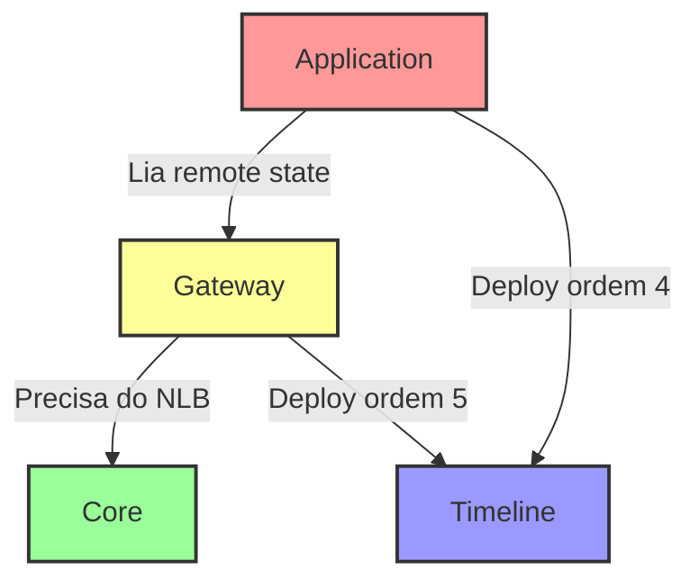
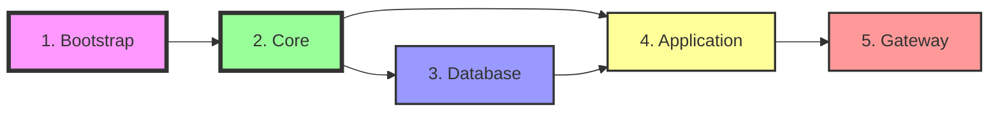
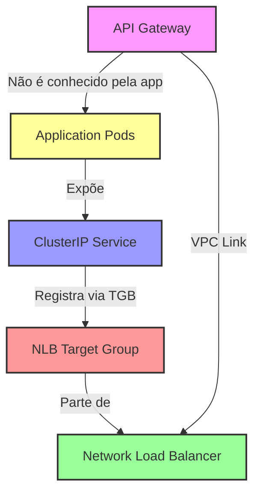

# 🔧 Correção de Dependências Circulares

## ❌ **Problema Identificado**

### Erro Original:
```
Error: Unable to find remote state
  with data.terraform_remote_state.gateway,
  on main.tf line 43
No stored state was found for the given workspace in the given backend.
```

### 🔍 **Causa Raiz:**

O repositório **application** estava tentando ler o remote state do **gateway**, mas na ordem de deploy:

```
4. Application (estava tentando ler gateway) ❌
5. Gateway (ainda não deployado)
```

### 📊 **Dependência Circular Detectada:**



**Problema:** Application (ordem 4) tentava ler Gateway (ordem 5) antes dele existir!

---

## ✅ **Solução Implementada**

### 🔧 **Correções Aplicadas:**

#### 1. **Removida Dependência no Application**

**Arquivo:** `tech-challenge-application/terraform/main.tf`

```diff
- data "terraform_remote_state" "gateway" {
-   backend = "s3"
-   config = {
-     bucket = "tech-challenge-tfstate-533267363894-4"
-     key    = "gateway/terraform.tfstate"
-     region = "us-east-1"
-   }
- }

  resource "kubernetes_config_map" "app_config" {
    data = {
      COGNITO_USER_POOL_ID  = data.terraform_remote_state.core.outputs.cognito_user_pool_id
      COGNITO_CLIENT_ID     = data.terraform_remote_state.core.outputs.cognito_user_pool_client_id
-     API_GATEWAY_URL       = data.terraform_remote_state.gateway.outputs.api_gateway_invoke_url
+     # API_GATEWAY_URL não é necessário - aplicação não precisa dessa informação
    }
  }
```

**Commit:** `3d1c8db` - "fix: Remove circular dependency on gateway"

---

## 📋 **Ordem de Deploy Corrigida**

### ✅ **Ordem Atual (Correta):**



| Etapa | Repositório | Depende de | Observação |
|-------|-------------|------------|------------|
| 1️⃣ | Bootstrap | - | Cria S3 + DynamoDB |
| 2️⃣ | Core | Bootstrap | Cria VPC, EKS, NLB, ECR, Cognito |
| 3️⃣ | Database | Core | Usa VPC do core |
| 4️⃣ | **Application** | Core + Database | ✅ NÃO depende de Gateway |
| 5️⃣ | **Gateway** | Core + Application | Usa NLB (core) + Service (application) |

---

## 🎯 **Por que Application NÃO Precisa do Gateway?**

### 🔍 **Análise de Dependências:**



### ✅ **Application precisa de:**
- ✅ VPC (do core)
- ✅ EKS Cluster (do core)
- ✅ RDS Endpoint (do database)
- ✅ Cognito Pool ID (do core)
- ✅ Target Group ARN (do core)

### ❌ **Application NÃO precisa de:**
- ❌ API Gateway URL
- ❌ VPC Link ID
- ❌ API Gateway Stage

**Motivo:** A aplicação **não sabe** que está atrás de um API Gateway. Ela apenas expõe um service Kubernetes e o AWS Load Balancer Controller cuida de registrar os pods no NLB.

---

## 🔄 **Fluxo de Tráfego (Application não conhece Gateway)**

```
┌─────────────────┐
│   User/Client   │
└────────┬────────┘
         │ HTTPS
         ▼
┌─────────────────┐
│  API Gateway    │ ◄── Application NÃO sabe disso
└────────┬────────┘
         │ VPC Link
         ▼
┌─────────────────┐
│      NLB        │
└────────┬────────┘
         │ Target Group
         ▼
┌─────────────────┐
│  Kubernetes     │ ◄── Application só expõe ClusterIP aqui
│  Service (80)   │
└────────┬────────┘
         │
    ┌────┴────┐
    │         │
    ▼         ▼
┌───────┐ ┌───────┐
│ Pod 1 │ │ Pod 2 │
└───────┘ └───────┘
```

---

## 📊 **Resumo das Correções**

### ✅ **Arquivos Modificados:**

| Arquivo | Mudança | Status |
|---------|---------|--------|
| `application/terraform/main.tf` | Removido `data.gateway` | ✅ Commitado |
| `application/terraform/main.tf` | Removido `API_GATEWAY_URL` do ConfigMap | ✅ Commitado |
| `infra-core/docs/ORDEM_DEPLOY.md` | Adicionado warning sobre ordem | ✅ Commitado |
| `infra-core/docs/ORDEM_DEPLOY.md` | Adicionado troubleshooting | ✅ Commitado |

### 🎯 **Commits Relacionados:**

```bash
# Application
3d1c8db - fix: Remove circular dependency on gateway - application deployed before gateway

# Documentation
8c1908f - docs: Clarify that Application must be deployed BEFORE Gateway
```

---

## ✅ **Validação da Correção**

### 🧪 **Teste da Ordem de Deploy:**

```bash
# 1. Bootstrap (primeira vez)
cd tech-challenge-infra-core/bootstrap
terraform apply

# 2. Core Infrastructure
cd tech-challenge-infra-core
terraform apply

# 3. Database
cd tech-challenge-infra-database
terraform apply

# 4. Application ✅ (NÃO lê gateway)
cd tech-challenge-application/terraform
terraform init
terraform apply  # ✅ Deve funcionar agora!

# 5. Gateway (lê application)
cd tech-challenge-infra-gateway-lambda
terraform apply  # ✅ Lê NLB (core) e Service (application)
```

### ✅ **Resultado Esperado:**

```
✅ Application: Plan succeeded, apply succeeded
✅ Gateway: Lê application remote state com sucesso
✅ Todos os recursos criados na ordem correta
```

---

## 🎓 **Lições Aprendidas**

### 📚 **Boas Práticas de Terraform:**

1. **Evitar Dependências Circulares:**
   - ✅ Desenhar fluxo de dependências **antes** de implementar
   - ✅ Usar `terraform graph` para visualizar dependências

2. **Remote State:**
   - ✅ Ler remote state apenas quando **realmente necessário**
   - ✅ Considerar se a informação é **crítica** ou apenas **informativa**

3. **Ordem de Deploy:**
   - ✅ Documentar ordem de deploy **explicitamente**
   - ✅ Adicionar warnings para dependências não óbvias

4. **ConfigMaps/Secrets:**
   - ✅ Incluir apenas informações que a **aplicação precisa em runtime**
   - ❌ Não incluir URLs externas só "por conveniência"

---

## 🚀 **Próximos Passos**

Agora você pode fazer o deploy completo seguindo a ordem:

1. ✅ Bootstrap (se ainda não fez)
2. ✅ Core Infrastructure
3. ✅ Database
4. ✅ **Application** ← Agora funciona!
5. ✅ Gateway

**✅ Problema resolvido! Deploy deve funcionar corretamente agora.**
