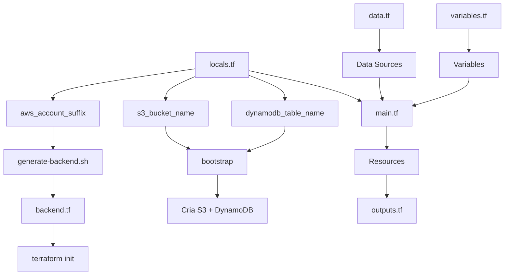

# 📁 Estrutura de Arquivos - Organizada e Limpa

## 🎯 Filosofia: Cada Arquivo com Sua Responsabilidade

```
tech-challenge-infra-core/
│
├── 📝 locals.tf              # APENAS locals (configuração centralizada)
├── 📊 data.tf                # APENAS data sources
├── 📝 variables.tf           # APENAS variables (com defaults)
├── 📤 outputs.tf             # APENAS outputs
├── 🔧 backend.tf             # Backend S3 (gerado automaticamente)
├── 🏗️ main.tf                # Recursos AWS
│
├── 🚀 generate-backend.sh    # Script para gerar backend.tf
│
└── bootstrap/
    ├── 📝 locals.tf          # Locals do bootstrap
    ├── 📊 data.tf            # Data sources do bootstrap  
    ├── 📝 variables.tf       # Variables com defaults
    ├── 📤 outputs.tf         # Outputs do bootstrap
    └── 🏗️ main.tf            # Recursos S3/DynamoDB
```

---

## 📝 locals.tf - APENAS Locals

**Responsabilidade:** Valores locais centralizados.

**Contém:**
- ✅ `aws_account_id`, `aws_account_suffix`, `aws_region`
- ✅ `s3_bucket_name`, `dynamodb_table_name` (gerados)
- ✅ `lab_role_arn`
- ✅ `common_tags`
- ✅ `is_correct_account` (validação)

**NÃO contém:**
- ❌ Data sources (vão em `data.tf`)
- ❌ Variables (vão em `variables.tf`)
- ❌ Outputs (vão em `outputs.tf`)

---

## 📊 data.tf - APENAS Data Sources

**Responsabilidade:** Consultas a dados externos.

**Contém:**
- ✅ `data "aws_caller_identity" "current"`
- ✅ `data "aws_iam_role" "lab_role"`
- ✅ `data "aws_availability_zones" "available"`
- ✅ `data "kubernetes_namespace" "kube_system"`

**NÃO contém:**
- ❌ Locals (vão em `locals.tf`)
- ❌ Resources (vão em `main.tf`)

---

## 📝 variables.tf - APENAS Variables

**Responsabilidade:** Declaração de variáveis com defaults.

**Contém:**
- ✅ `project_name` (default: "tech-challenge")
- ✅ `environment` (default: "dev")
- ✅ `owner` (default: "student")
- ✅ `node_instance_type` (default: "t3.small")
- ✅ `node_desired_size`, `node_min_size`, `node_max_size`

**Benefícios:**
- ✅ Sem necessidade de `terraform.tfvars`
- ✅ Valores sensatos por padrão
- ✅ Facilita estudo

---

## 📤 outputs.tf - APENAS Outputs

**Responsabilidade:** Expor valores para outros módulos.

**Contém:**
- ✅ VPC outputs (IDs, CIDRs, subnets)
- ✅ EKS outputs (cluster, nodes, endpoints)
- ✅ Cognito outputs
- ✅ NLB outputs
- ✅ ECR outputs
- ✅ Account validation
- ✅ Backend config

**NÃO contém:**
- ❌ Locals (vão em `locals.tf`)
- ❌ Data sources (vão em `data.tf`)

---

## 🔧 backend.tf - Backend S3 (Gerado Automaticamente)

**Responsabilidade:** Configuração do backend remoto.

**⚠️ IMPORTANTE:**
- ❌ **NÃO EDITE MANUALMENTE**
- ✅ Use `./generate-backend.sh` para gerar

**Como funciona:**
```bash
# 1. Edite locals.tf
locals {
  aws_account_suffix = "533267363894-20"  # NOVO
}

# 2. Gere novo backend
./generate-backend.sh

# 3. Reinicialize
terraform init -reconfigure
```

**Por quê?**
- Backend S3 não aceita interpolação de variáveis
- Precisa ser gerado antes do `terraform init`

---

## 🏗️ main.tf - APENAS Resources

**Responsabilidade:** Definir recursos AWS.

**Contém:**
- ✅ Terraform config + providers
- ✅ VPC, Subnets, Route Tables
- ✅ EKS Cluster + Node Group
- ✅ Load Balancer Controller (Helm)
- ✅ Cognito User Pool
- ✅ ECR Repository
- ✅ Network Load Balancer

**NÃO contém:**
- ❌ Data sources (vão em `data.tf`)
- ❌ Locals (vão em `locals.tf`)
- ❌ Outputs (vão em `outputs.tf`)
- ❌ Backend config (vai em `backend.tf`)

---

## 🔄 Fluxo de Configuração



---

## ✅ Checklist de Organização

### **Separação de Responsabilidades:**
- [x] `locals.tf` - APENAS locals
- [x] `data.tf` - APENAS data sources
- [x] `variables.tf` - APENAS variables
- [x] `outputs.tf` - APENAS outputs
- [x] `backend.tf` - APENAS backend (gerado)
- [x] `main.tf` - APENAS resources

### **Backend Gerenciado:**
- [x] `backend.tf` gerado automaticamente
- [x] Script `generate-backend.sh` funcional
- [x] Sem hardcode de nomes

### **Sem Arquivos Desnecessários:**
- [x] Sem `terraform.tfvars` (usa defaults)
- [x] Sem `lab-config.tf` (renomeado para `locals.tf`)

---

## 🎯 Como Alterar o Account Suffix

### **Passo 1: Edite `locals.tf`**

```terraform
locals {
  aws_account_suffix = "533267363894-20"  # 🔄 NOVO VALOR
}
```

### **Passo 2: Gere Novo Backend**

```bash
./generate-backend.sh
```

**Saída esperada:**
```
🔍 Lendo configuração de locals.tf...
✅ Account Suffix encontrado: 533267363894-20

📦 Configuração do Backend:
   Bucket S3:       tech-challenge-tfstate-533267363894-20
   DynamoDB Table:  tech-challenge-terraform-lock-533267363894-20

✅ Arquivo backend.tf gerado com sucesso!
```

### **Passo 3: Atualize Bootstrap**

```bash
cd bootstrap
# Edite variables.tf
terraform destroy  # Remove recursos antigos
terraform apply    # Cria com novos nomes
```

### **Passo 4: Reinicialize Terraform**

```bash
cd ..
terraform init -reconfigure
terraform apply
```

---

## 📊 Comparação: Antes vs Agora

| Aspecto | ❌ Antes | ✅ Agora |
|---------|---------|---------|
| **Locals** | Misturado com data sources | Arquivo próprio (`locals.tf`) |
| **Data Sources** | Espalhados em vários arquivos | Arquivo próprio (`data.tf`) |
| **Backend** | Hardcoded no `main.tf` | Gerado automaticamente (`backend.tf`) |
| **Organização** | Difícil navegar | 1 arquivo = 1 responsabilidade |
| **Manutenção** | Confuso onde editar | Clara e óbvia |

---

## 🚀 Bootstrap (Submódulo)

**Mesma estrutura limpa:**

```
bootstrap/
├── locals.tf       # Locals do bootstrap
├── data.tf         # Data sources (se houver)
├── variables.tf    # Variables com defaults
├── outputs.tf      # Outputs
└── main.tf         # Resources S3/DynamoDB
```

**Sincronização:**
- `locals.tf` espelha valores do principal
- `variables.tf` com mesmos defaults
- Sem backend S3 (usa local)

---

## 💡 Benefícios da Nova Estrutura

### **1. Clareza**
- ✅ Um arquivo = uma responsabilidade
- ✅ Fácil encontrar onde editar
- ✅ Nome do arquivo descreve o conteúdo

### **2. Manutenção**
- ✅ Backend gerado automaticamente
- ✅ Menos risco de erro
- ✅ Mudanças centralizadas

### **3. Padronização**
- ✅ Segue convenções Terraform
- ✅ Estrutura profissional
- ✅ Fácil de ensinar

### **4. Escalabilidade**
- ✅ Adicionar novos data sources é óbvio (data.tf)
- ✅ Adicionar novos outputs é óbvio (outputs.tf)
- ✅ Novos desenvolvedores entendem rápido

---

## 📚 Referências

- [Terraform Best Practices](https://www.terraform-best-practices.com/)
- [Terraform Style Guide](https://www.terraform.io/docs/language/syntax/style.html)

---

**Última atualização:** 06/10/2025  
**Versão:** 3.0 - Estrutura Completamente Reorganizada
