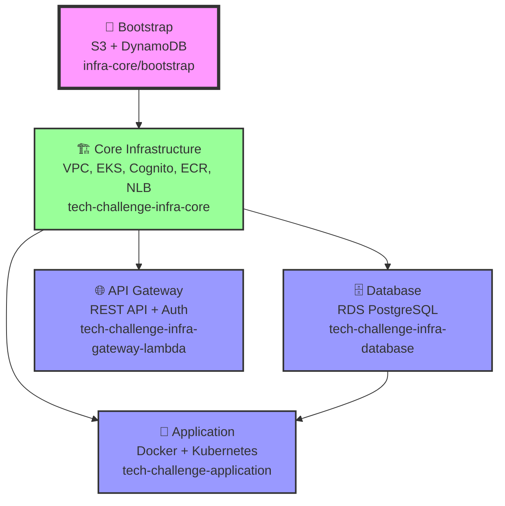
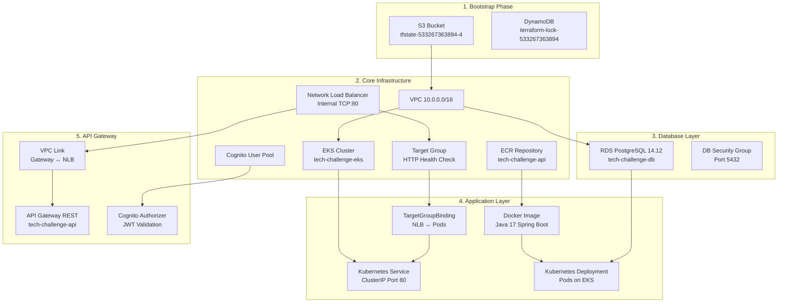
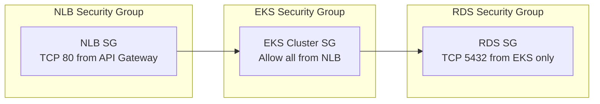

# 🔗 Mapa de Dependências - Tech Challenge

## 📊 Diagrama de Dependências entre Repositórios



## 🔄 Remote State Data Sources

### infra-core (Producer)

```terraform
# Outputs que outros repositórios consomem
output "vpc_id" { value = aws_vpc.main.id }
output "private_subnet_ids" { value = [aws_subnet.private_1.id, aws_subnet.private_2.id] }
output "eks_cluster_name" { value = aws_eks_cluster.main.name }
output "cognito_user_pool_arn" { value = aws_cognito_user_pool.main.arn }
output "nlb_arn" { value = aws_lb.app.arn }
output "target_group_arn" { value = aws_lb_target_group.app.arn }
output "ecr_repository_url" { value = aws_ecr_repository.app.repository_url }
```

### infra-database (Consumer + Producer)

```terraform
# Consome do infra-core
data "terraform_remote_state" "core" {
  backend = "s3"
  config = {
    bucket = "tech-challenge-tfstate-533267363894-4"
    key    = "infra/core/terraform.tfstate"
    region = "us-east-1"
  }
}

# Usa outputs do core
vpc_id     = data.terraform_remote_state.core.outputs.vpc_id
subnet_ids = data.terraform_remote_state.core.outputs.private_subnet_ids

# Produz outputs para application
output "db_endpoint" { value = aws_db_instance.main.endpoint }
output "db_port" { value = aws_db_instance.main.port }
```

### application (Consumer)

```terraform
# Consome do infra-core
data "terraform_remote_state" "core" {
  backend = "s3"
  config = {
    bucket = "tech-challenge-tfstate-533267363894-4"
    key    = "infra/core/terraform.tfstate"
    region = "us-east-1"
  }
}

# Consome do infra-database
data "terraform_remote_state" "database" {
  backend = "s3"
  config = {
    bucket = "tech-challenge-tfstate-533267363894-4"
    key    = "infra/database/terraform.tfstate"
    region = "us-east-1"
  }
}

# Usa outputs
target_group_arn = data.terraform_remote_state.core.outputs.target_group_arn
db_endpoint = data.terraform_remote_state.database.outputs.db_endpoint
```

### infra-gateway-lambda (Consumer)

```terraform
# Consome do infra-core
data "terraform_remote_state" "core" {
  backend = "s3"
  config = {
    bucket = "tech-challenge-tfstate-533267363894-4"
    key    = "infra/core/terraform.tfstate"
    region = "us-east-1"
  }
}

# Usa outputs
nlb_arn = data.terraform_remote_state.core.outputs.nlb_arn
cognito_user_pool_arn = data.terraform_remote_state.core.outputs.cognito_user_pool_arn
```

## 🎯 Fluxo de Integração Detalhado



## 🔐 Security Groups Integration



## 📦 Ordem de Deploy com Dependências

### 1. **Bootstrap** (Manual - Apenas uma vez)

```bash
Repository: tech-challenge-infra-core
Path: ./bootstrap/
Command: terraform apply
Creates: S3 bucket + DynamoDB table
Dependencies: None
```

### 2. **Core Infrastructure** (Foundational)

```bash
Repository: tech-challenge-infra-core
Path: ./
Dependencies: Bootstrap S3 bucket
Creates:
  ✅ VPC + Subnets
  ✅ EKS Cluster (takes ~15 minutes)
  ✅ Cognito User Pool
  ✅ ECR Repository
  ✅ Network Load Balancer
  ✅ Target Group
```

### 3. **Database** (Depends on VPC)

```bash
Repository: tech-challenge-infra-database
Dependencies: 
  ← core.vpc_id
  ← core.private_subnet_ids
Creates:
  ✅ RDS PostgreSQL instance
  ✅ DB Subnet Group
  ✅ DB Security Group
```

### 4. **Application** (Depends on EKS + RDS)

```bash
Repository: tech-challenge-application
Dependencies:
  ← core.eks_cluster_name
  ← core.target_group_arn
  ← core.ecr_repository_url
  ← database.db_endpoint
Creates:
  ✅ Docker image (pushed to ECR)
  ✅ Kubernetes Deployment
  ✅ Kubernetes Service (ClusterIP)
  ✅ TargetGroupBinding (connects K8s to NLB)
```

### 5. **API Gateway** (Depends on NLB + Cognito)

```bash
Repository: tech-challenge-infra-gateway-lambda
Dependencies:
  ← core.nlb_arn
  ← core.cognito_user_pool_arn
Creates:
  ✅ API Gateway REST API
  ✅ VPC Link (connects to NLB)
  ✅ Cognito Authorizer
  ✅ API Methods with authorization
```

## ⚡ Critical Path Analysis

### 🕐 **Timeline de Deploy (Cold Start)**

```
┌─────────────────────────────────────────────────────────────┐
│ Total Time: ~25-30 minutes                                   │
├─────────────────────────────────────────────────────────────┤
│ Bootstrap:        0-2 min   (S3 + DynamoDB)                 │
│ Core Infra:       2-17 min  (EKS cluster creation)          │
│ Database:         17-22 min (RDS instance)                  │
│ Application:      22-27 min (Docker build + K8s deploy)     │
│ API Gateway:      27-30 min (API Gateway + integrations)    │
└─────────────────────────────────────────────────────────────┘
```

### ⚠️ **Points of Failure**

1. **EKS Cluster Creation** (15+ minutes)
   - Can fail due to IAM permissions
   - Subnet configuration issues
   - Resource limits in region

2. **TargetGroupBinding** 
   - Requires AWS Load Balancer Controller
   - K8s RBAC permissions
   - Target group health checks

3. **VPC Link Integration**
   - NLB must be ready and healthy
   - Security group configurations
   - Network routing

## 🧪 Testing Integration Points

### 1. **Core → Database Integration**

```bash
# Verify VPC connection
aws rds describe-db-instances --db-instance-identifier tech-challenge-db \
  --query 'DBInstances[0].DBSubnetGroup.VpcId'

# Should match VPC from core
aws eks describe-cluster --name tech-challenge-eks \
  --query 'cluster.resourcesVpcConfig.vpcId'
```

### 2. **Core → Application Integration**

```bash
# Verify TargetGroupBinding
kubectl describe targetgroupbinding tech-challenge-tgb

# Check target group health
aws elbv2 describe-target-health \
  --target-group-arn $(terraform output -raw target_group_arn)
```

### 3. **Core → Gateway Integration**

```bash
# Test VPC Link
aws apigateway get-vpc-link --vpc-link-id <vpc-link-id>

# Test API Gateway endpoint
curl -H "Authorization: Bearer <jwt-token>" \
  https://<api-id>.execute-api.us-east-1.amazonaws.com/dev/orders
```

## 🔄 Update Strategies

### Rolling Updates (No Downtime)

```bash
# 1. Application updates (Docker image)
# Kubernetes handles rolling deployment automatically

# 2. Database schema updates
# Use database migrations in application startup

# 3. API Gateway updates
# Blue/green deployment through stages
```

### Infrastructure Updates

```bash
# 1. Core infrastructure changes
# Plan carefully - affects all dependent resources

# 2. Network changes (VPC, subnets)
# May require complete rebuild - DANGEROUS

# 3. EKS version upgrades
# Follow AWS upgrade path, test thoroughly
```

## 📋 Dependency Checklist

### Before Making Changes

- [ ] Identify which outputs are consumed by other repos
- [ ] Check if resource names will change
- [ ] Verify state file dependencies
- [ ] Plan rollback strategy

### During Deployment

- [ ] Monitor logs for each dependency
- [ ] Verify outputs are available before dependent deploy
- [ ] Check health endpoints after each layer
- [ ] Validate security group rules

### After Deployment

- [ ] Test end-to-end flow
- [ ] Verify all integrations working
- [ ] Check monitoring and logs
- [ ] Document any new dependencies

---

> **🎯 Este mapa serve como guia para entender como os repositórios se integram e quais cuidados tomar ao fazer mudanças.**