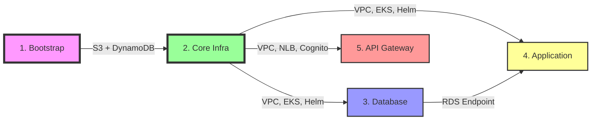
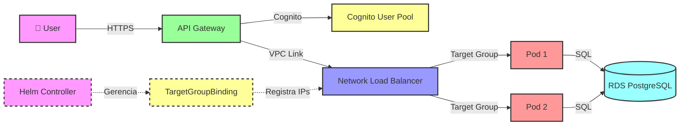

# 🚀 Ordem de Deploy - Tech Challenge

## 📋 Sequência de Execução Atualizada

### ⏱️ Timeline de Deploy



---

## 1️⃣ **Bootstrap** (Apenas Primeira Vez)

### 📍 Repositório: `tech-challenge-infra-core`
### 🔧 Workflow: `bootstrap.yml`
### ⚡ Trigger: Manual Dispatch

```bash
# Via GitHub Actions
Actions → Bootstrap → Run workflow
```

### 📦 Recursos Criados:
- ✅ S3 Bucket: `tech-challenge-tfstate-533267363894-4`
- ✅ DynamoDB Table: `tech-challenge-terraform-lock-533267363894`

### ⏱️ Tempo Estimado: 2-3 minutos

---

## 2️⃣ **Core Infrastructure**

### 📍 Repositório: `tech-challenge-infra-core`
### 🔧 Workflow: `main.yml`
### ⚡ Trigger: Push to main

```bash
cd tech-challenge-infra-core
git add .
git commit -m "feat: Core infrastructure"
git push origin main
```

### 📦 Recursos Criados:
- ✅ VPC com 2 AZs (10.0.0.0/16)
- ✅ Subnets Públicas e Privadas
- ✅ NAT Gateway
- ✅ Internet Gateway
- ✅ EKS Cluster: `tech-challenge-eks` (v1.33)
- ✅ EKS Node Group (1 node SPOT t3.medium)
- ✅ Cognito User Pool + Client
- ✅ ECR Repository: `tech-challenge-api`
- ✅ Network Load Balancer (interno)
- ✅ Target Group (port 80, IP-based)
- ✅ **AWS Load Balancer Controller** (Helm chart v1.9.2)
- ✅ Service Account do controller
- ✅ CRDs (TargetGroupBinding, IngressClassParams)

### ⏱️ Tempo Estimado: 15-20 minutos

### 🔍 Validação:
```bash
# Verificar EKS
aws eks describe-cluster --name tech-challenge-eks

# Verificar Helm Release
kubectl get pods -n kube-system -l app.kubernetes.io/name=aws-load-balancer-controller

# Verificar CRDs
kubectl get crd targetgroupbindings.elbv2.k8s.aws

# Verificar NLB
aws elbv2 describe-load-balancers --names tech-challenge-nlb
```

---

## 3️⃣ **Database**

### 📍 Repositório: `tech-challenge-infra-database`
### 🔧 Workflow: `main.yml`
### ⚡ Trigger: Push to main

```bash
cd tech-challenge-infra-database
git add .
git commit -m "feat: Database infrastructure"
git push origin main
```

### 📦 Recursos Criados:
- ✅ RDS PostgreSQL 14.12
- ✅ DB Subnet Group
- ✅ Security Group (porta 5432)

### ⏱️ Tempo Estimado: 10-15 minutos

### 🔍 Validação:
```bash
# Verificar RDS
aws rds describe-db-instances --db-instance-identifier tech-challenge-db
```

---

## 4️⃣ **Application**

### 📍 Repositório: `tech-challenge-application`
### 🔧 Workflow: `main.yml`
### ⚡ Trigger: Push to main

```bash
cd tech-challenge-application
git add .
git commit -m "feat: Application deployment"
git push origin main
```

### 📦 Recursos Criados:
- ✅ Docker Build (Maven)
- ✅ Docker Push para ECR
- ✅ Kubernetes Namespace: `tech-challenge`
- ✅ Kubernetes Service (ClusterIP)
- ✅ Kubernetes Deployment (2 replicas)
- ✅ **TargetGroupBinding** (reconcilia automaticamente)
- ✅ Pods registrados no NLB Target Group

### ⏱️ Tempo Estimado: 8-12 minutos

### 🔍 Validação:
```bash
# Verificar Pods
kubectl get pods -n tech-challenge

# Verificar Service
kubectl get svc -n tech-challenge

# Verificar TargetGroupBinding
kubectl describe targetgroupbinding tech-challenge-app-tgb -n tech-challenge

# Verificar Targets no NLB
aws elbv2 describe-target-health --target-group-arn <ARN_DO_TARGET_GROUP>
```

---

## 5️⃣ **API Gateway**

### 📍 Repositório: `tech-challenge-infra-gateway-lambda`
### 🔧 Workflow: `deploy.yml`
### ⚡ Trigger: Push to main

```bash
cd tech-challenge-infra-gateway-lambda
git add .
git commit -m "feat: API Gateway configuration"
git push origin main
```

### 📦 Recursos Criados:
- ✅ API Gateway REST API
- ✅ VPC Link para NLB
- ✅ Cognito Authorizer
- ✅ Recursos e Métodos:
  - `GET /health` (público)
  - `GET /products` (público)
  - `GET /categories` (público)
  - `POST /webhooks` (público)
  - `POST /orders` (Cognito auth)
  - `GET /orders/{id}` (Cognito auth)
  - `POST /payments` (Cognito auth)
  - `POST /customers` (Cognito auth)

### ⏱️ Tempo Estimado: 5-8 minutos

### 🔍 Validação:
```bash
# Verificar API Gateway
aws apigateway get-rest-apis --query 'items[?name==`tech-challenge-api`]'

# Testar Endpoint Público
curl -X GET https://<API_ID>.execute-api.us-east-1.amazonaws.com/dev/health

# Testar Endpoint com Cognito
curl -X POST https://<API_ID>.execute-api.us-east-1.amazonaws.com/dev/orders \
  -H "Authorization: Bearer <TOKEN>" \
  -H "Content-Type: application/json" \
  -d '{"items": []}'
```

---

## ✅ **Checklist Completo de Deploy**

### Pré-requisitos:
- [ ] AWS Academy Lab ativo
- [ ] GitHub Secrets configurados em todos os repositórios:
  - `AWS_ACCESS_KEY_ID`
  - `AWS_SECRET_ACCESS_KEY`
  - `AWS_SESSION_TOKEN`
  - `DB_PASSWORD` (database + application)
  - `JWT_SECRET` (application)

### Ordem de Execução:
- [ ] 1. Bootstrap (apenas primeira vez)
- [ ] 2. Core Infrastructure (aguardar conclusão)
- [ ] 3. Database (aguardar conclusão)
- [ ] 4. Application (aguardar conclusão)
- [ ] 5. API Gateway (aguardar conclusão)

### Validações:
- [ ] Helm Release instalado e pods running
- [ ] CRDs criados (TargetGroupBinding)
- [ ] NLB com Target Group configurado
- [ ] RDS acessível da VPC
- [ ] Pods da aplicação rodando
- [ ] TargetGroupBinding reconciliado
- [ ] Targets healthy no NLB
- [ ] API Gateway respondendo

---

## 🔄 **Fluxo de Tráfego Final**



---

## 📊 **Resumo de Tempos**

| Etapa | Tempo Estimado | Dependências |
|-------|----------------|--------------|
| 1. Bootstrap | 2-3 min | Nenhuma |
| 2. Core Infrastructure | 15-20 min | Bootstrap |
| 3. Database | 10-15 min | Core |
| 4. Application | 8-12 min | Core + Database |
| 5. API Gateway | 5-8 min | Core |

**⏱️ Tempo Total: ~45-60 minutos**

---

## 🆘 **Troubleshooting**

### ❌ Helm Release Failed
```bash
# Ver logs do controller
kubectl logs -n kube-system -l app.kubernetes.io/name=aws-load-balancer-controller

# Reinstalar manualmente
helm uninstall aws-load-balancer-controller -n kube-system
terraform apply -target=helm_release.aws_load_balancer_controller
```

### ❌ TargetGroupBinding não reconcilia
```bash
# Verificar controller
kubectl get pods -n kube-system -l app.kubernetes.io/name=aws-load-balancer-controller

# Ver eventos
kubectl describe targetgroupbinding tech-challenge-app-tgb -n tech-challenge

# Verificar logs
kubectl logs -n kube-system <controller-pod-name>
```

### ❌ Targets Unhealthy
```bash
# Verificar health check
aws elbv2 describe-target-health --target-group-arn <ARN>

# Verificar Security Group
kubectl get svc -n tech-challenge -o yaml

# Testar conexão direta
kubectl port-forward -n tech-challenge svc/tech-challenge-app 8080:80
curl http://localhost:8080/health
```

---

**✅ Deploy completo com automação via Terraform + Helm!**
