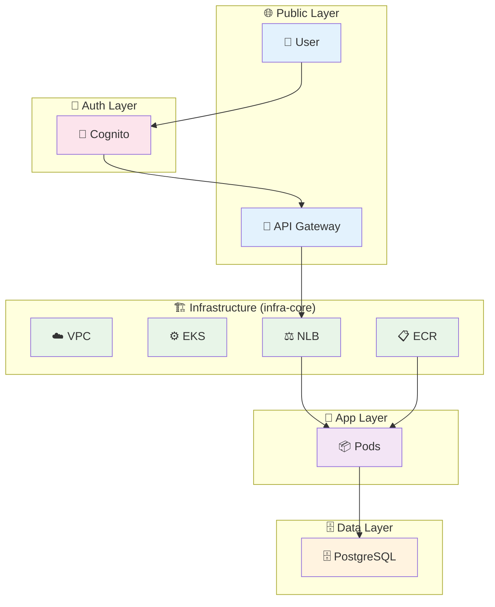

# 📚 Tech Challenge - Índice de Documentação

> **Documentação completa da arquitetura, configurações e procedimentos do projeto Tech Challenge**

## 📋 Documentos Disponíveis

### 🏗️ **Arquitetura e Design**

| Documento | Descrição | Uso Principal |
|-----------|-----------|---------------|
| [**ARQUITETURA_TECH_CHALLENGE.md**](./ARQUITETURA_TECH_CHALLENGE.md) | Documentação completa da arquitetura com diagramas Mermaid | 📖 Entendimento geral do sistema |
| [**MAPA_DEPENDENCIAS.md**](./MAPA_DEPENDENCIAS.md) | Mapeamento detalhado de dependências entre repositórios | 🔗 Planejamento de mudanças |

### 🔧 **Configuração e Deploy**

| Documento | Descrição | Uso Principal |
|-----------|-----------|---------------|
| [**CONFIGURACOES_COMPARTILHADAS.md**](./CONFIGURACOES_COMPARTILHADAS.md) | Lista de todas as configurações que devem ser sincronizadas | ⚙️ Manutenção e mudanças |
| [**VALIDACAO_WORKFLOWS.md**](./VALIDACAO_WORKFLOWS.md) | Validação e status dos workflows de CI/CD | 🚀 Deploy e troubleshooting |

### 📝 **Correções e Histórico**

| Documento | Descrição | Uso Principal |
|-----------|-----------|---------------|
| [**CORREÇÕES_ARQUITETURA_FINAL.md**](./CORREÇÕES_ARQUITETURA_FINAL.md) | Histórico de correções implementadas | 📋 Referência histórica |

## 🎯 Guia de Navegação

### 🆕 **Para novos desenvolvedores:**
1. 📖 Leia [ARQUITETURA_TECH_CHALLENGE.md](./ARQUITETURA_TECH_CHALLENGE.md) para entender o sistema
2. 🔗 Consulte [MAPA_DEPENDENCIAS.md](./MAPA_DEPENDENCIAS.md) para entender as integrações
3. ⚙️ Revise [CONFIGURACOES_COMPARTILHADAS.md](./CONFIGURACOES_COMPARTILHADAS.md) para configurações críticas

### 🔧 **Para fazer mudanças na infraestrutura:**
1. ⚙️ **SEMPRE** consulte [CONFIGURACOES_COMPARTILHADAS.md](./CONFIGURACOES_COMPARTILHADAS.md) primeiro
2. 🔗 Verifique impactos em [MAPA_DEPENDENCIAS.md](./MAPA_DEPENDENCIAS.md)
3. 🚀 Valide workflows em [VALIDACAO_WORKFLOWS.md](./VALIDACAO_WORKFLOWS.md)

### 🚀 **Para fazer deploy:**
1. 🚀 Siga ordem em [VALIDACAO_WORKFLOWS.md](./VALIDACAO_WORKFLOWS.md)
2. 📖 Consulte comandos em [ARQUITETURA_TECH_CHALLENGE.md](./ARQUITETURA_TECH_CHALLENGE.md)
3. 🔗 Monitore dependências por [MAPA_DEPENDENCIAS.md](./MAPA_DEPENDENCIAS.md)

### 🐛 **Para troubleshooting:**
1. 📖 Use comandos de debug em [ARQUITETURA_TECH_CHALLENGE.md](./ARQUITETURA_TECH_CHALLENGE.md)
2. 🚀 Verifique status dos workflows em [VALIDACAO_WORKFLOWS.md](./VALIDACAO_WORKFLOWS.md)
3. 🔗 Valide integrações por [MAPA_DEPENDENCIAS.md](./MAPA_DEPENDENCIAS.md)

## 🔍 Resumo da Arquitetura



## 📊 Status Atual

| Componente | Status | Observações |
|------------|--------|-------------|
| 🏗️ **Infraestrutura Core** | ✅ Pronta | VPC, EKS, Cognito, ECR, NLB |
| 🗄️ **Database** | ✅ Pronta | PostgreSQL com secrets hardcoded |
| 🐳 **Aplicação** | ✅ Pronta | Java Spring Boot no EKS |
| 🌐 **API Gateway** | ✅ Pronta | REST API com Cognito Auth |
| 🔄 **CI/CD** | ✅ Validado | Workflows corrigidos e testados |
| 📚 **Documentação** | ✅ Completa | 5 documentos técnicos |

## ⚡ Quick Start

### 🚀 **Deploy Completo**

```bash
# 1. Bootstrap (apenas primeira vez)
gh workflow run bootstrap.yml -R group-240/tech-challenge-infra-core

# 2. Deploy em ordem
gh workflow run main.yml -R group-240/tech-challenge-infra-core
sleep 300
gh workflow run main.yml -R group-240/tech-challenge-infra-database
sleep 180
gh workflow run main.yml -R group-240/tech-challenge-application
sleep 240
gh workflow run deploy.yml -R group-240/tech-challenge-infra-gateway-lambda
```

### 🔍 **Verificação Rápida**

```bash
# Health check
curl https://<api-gateway-url>/api/health

# Cognito protected endpoint
curl -H "Authorization: Bearer <jwt-token>" \
  https://<api-gateway-url>/api/orders
```

## 🔧 Configurações Críticas

| Configuração | Valor | Impacto se Alterar |
|--------------|-------|--------------------|
| `project_name` | `tech-challenge` | 🔴 **CRÍTICO** - Recria todos os recursos |
| `account_id` | `533267363894` | 🔴 **CRÍTICO** - Quebra backend Terraform |
| `aws_region` | `us-east-1` | 🔴 **CRÍTICO** - Move toda infraestrutura |
| S3 Bucket | `tech-challenge-tfstate-533267363894-4` | 🔴 **CRÍTICO** - Perde state |

## 📞 Suporte

### 🐛 **Problemas Comuns**

| Problema | Documento de Referência | Seção |
|----------|------------------------|-------|
| Workflow falhou | [VALIDACAO_WORKFLOWS.md](./VALIDACAO_WORKFLOWS.md) | Troubleshooting |
| Configuração inconsistente | [CONFIGURACOES_COMPARTILHADAS.md](./CONFIGURACOES_COMPARTILHADAS.md) | Checklist |
| Dependência quebrada | [MAPA_DEPENDENCIAS.md](./MAPA_DEPENDENCIAS.md) | Points of Failure |
| Arquitetura não funciona | [ARQUITETURA_TECH_CHALLENGE.md](./ARQUITETURA_TECH_CHALLENGE.md) | Monitoramento |

### 📋 **Checklist de Manutenção**

- [ ] Configurações sincronizadas entre repositórios
- [ ] Workflows funcionando em todos os repos
- [ ] Dependências validadas e mapeadas
- [ ] Documentação atualizada com mudanças
- [ ] Testes end-to-end funcionando

---

> **📅 Última Atualização:** 04/10/2025  
> **👥 Mantenedores:** Equipe Tech Challenge  
> **🔄 Versão da Documentação:** 1.0.0

**Esta documentação está completa e pronta para uso em produção! 🚀**